# Webscale Multimodal Data Pipeline

A high-performance, distributed opensource web-scale (hundrends of billions) multimodal data processing pipelines built with Ray, featuring Rust-accelerated and GPU-optimized operators.

This repository aims to replicate SOTA multimodal datapipelines, like

- [Z-Image: An Efficient Image Generation Foundation Model](https://arxiv.org/pdf/2511.22699)
- [Qwen3-VL](https://arxiv.org/pdf/2511.21631)
- [Qwen-Image](https://qianwen-res.oss-cn-beijing.aliyuncs.com/Qwen-Image/Qwen_Image.pdf)
- [HunyuanImage 3.0](https://arxiv.org/pdf/2509.23951)
- [HunyuanORC](https://github.com/Tencent-Hunyuan/HunyuanOCR)
- [PaddleOCR 3.0](https://arxiv.org/pdf/2507.05595)
- [PaddleOCR-VL](https://arxiv.org/pdf/2510.14528)
- [Seed1.5-VL](https://arxiv.org/pdf/2505.07062)
- [SeedEdit 3.0](https://arxiv.org/pdf/2506.05083)
- [BAGEL: The Open-Source Unified Multimodal Model](https://arxiv.org/pdf/2505.14683)
- [HoneyBee: Data Recipes for Vision-Language Reasoners](https://arxiv.org/pdf/2510.12225)
- [MiMo-VL](https://arxiv.org/pdf/2506.03569)
- [Cosmos World Foundation Model Platform for Physical AI](https://arxiv.org/pdf/2501.03575)
- [Imagen 3](https://arxiv.org/abs/2408.07009)

## Installation

```bash
# Clone the repository
git clone https://github.com/duoan/webscale-multimodal-datapipeline.git
cd webscale-multimodal-datapipeline

# Install with Rust acceleration (recommended)
uv pip install -e .

# Or install without Rust (pure Python fallback)
uv sync
```

> Requires Rust toolchain for building accelerated operators. Install via [rustup](https://rustup.rs/).

## Quick Start

```bash
# Run pipeline with config
wmd run --config configs/z_image.yaml

# Or with options
wmd run -c configs/z_image.yaml --max-samples 1000 --batch-size 500
```

## Operators

> 🦀 = Rust Accelerated | 🖥️ = GPU Optimized

### Refiners

Refiners enrich records with new fields (inplace).

| Operator | Description | Acceleration | Doc |
|----------|-------------|--------------|-----|
| `ImageMetadataRefiner` | Extracts width, height, format, file size | CPU | [doc](operators/refiners/image_metadata.md) |
| `ImageTechnicalQualityRefiner` | Compression artifacts, information entropy | 🦀 Rust | [doc](operators/refiners/image_technical_quality.md) |
| `ImageVisualDegradationsRefiner` | Color cast, blurriness, watermark, noise | CPU | [doc](operators/refiners/image_visual_degradations.md) |
| `ImageClipEmbeddingRefiner` | CLIP embeddings via OpenCLIP | 🖥️ GPU | [doc](operators/refiners/image_clip_embedding.md) |
| `ImageSigLIPEmbeddingRefiner` | SigLIP2 embeddings via HuggingFace | 🖥️ GPU | [doc](operators/refiners/image_siglip_embedding.md) |
| `ImageAestheticQualityRefiner` | Aesthetic score (requires CLIP emb) | CPU | [doc](operators/refiners/image_aesthetic_quality.md) |
| `ImageAIGCDetectorRefiner` | AI-generated image detection (requires SigLIP emb) | CPU | [doc](operators/refiners/image_aigc_detector.md) |

### Filters

Filters remove records based on conditions.

| Operator | Description | Doc |
|----------|-------------|-----|
| `ImageQualityFilter` | Filter by size, quality metrics | [doc](operators/filters/image_quality_filter.md) |

### Deduplicators

Deduplicators remove duplicate records.

| Operator | Description | Acceleration | Doc |
|----------|-------------|--------------|-----|
| `ImagePhashDeduplicator` | Perceptual hash deduplication | 🦀 Rust | [doc](operators/dedup/image_phash_dedup.md) |

## Architecture

### Pipeline Overview


### Worker Pool & Load Balancing

```mermaid
%%{init: {'theme': 'base', 'themeVariables': { 'primaryColor': '#059669', 'primaryTextColor': '#fff', 'primaryBorderColor': '#10b981', 'lineColor': '#6ee7b7', 'secondaryColor': '#064e3b', 'tertiaryColor': '#065f46', 'background': '#0f0f23', 'mainBkg': '#064e3b', 'nodeBorder': '#10b981', 'clusterBkg': '#064e3b', 'clusterBorder': '#10b981'}}}%%
flowchart LR
    subgraph Input["Batches"]
        B0["B0"] & B1["B1"] & B2["B2"] & B3["B3"]
        B4["B4"] & B5["B5"] & B6["B6"] & B7["B7"]
    end

    subgraph CPU["CPU Pool ×8 workers"]
        C0["C0 🦀"] & C1["C1 🦀"] & C2["C2 🦀"] & C3["C3 🦀"]
        C4["C4 🦀"] & C5["C5 🦀"] & C6["C6 🦀"] & C7["C7 🦀"]
    end

    subgraph GPU["GPU Pool ×2 workers"]
        G0["G0 CLIP"]
        G1["G1 CLIP"]
    end

    B0 --> C0
    B1 --> C1
    B2 --> C2
    B3 --> C3
    B4 --> C4
    B5 --> C5
    B6 --> C6
    B7 --> C7

    C0 & C1 & C2 & C3 --> G0
    C4 & C5 & C6 & C7 --> G1
```



### Execution Sequence


### Timeline (Parallel Execution)


> **Key Points**:
>
> - **CPU Pool**: 8 workers for metadata, quality (🦀 Rust), filtering, dedup
> - **GPU Pool**: 2 workers for CLIP embeddings (limited by VRAM)
> - **Load Balancing**: Ray auto-distributes batches to idle workers

## Configuration

### Example `configs/z_image.yaml`

```yaml
# Data source
data_loader:
  type: HuggingFaceDataLoader
  params:
    dataset_name: "jp1924/Laion400m-1"
    split: "train"
    streaming: true

# Processing stages
stages:
  # Stage 1: Basic metadata and quality (CPU, Rust-accelerated)
  - name: basic_stage
    operators:
      - name: image_metadata_refiner
      - name: image_technical_quality_refiner  # 🦀 Rust-accelerated
      - name: image_quality_filter
        params:
          min_width: 128
          min_height: 128
          max_compression_artifacts: 0.8
          min_information_entropy: 0.0
      - name: image_phash_deduplicator  # 🦀 Rust-accelerated
    worker:
      num_replicas: 2
      resources:
        cpu: 1

  # Stage 2: Embedding extraction (GPU)
  - name: embedding_stage
    operators:
      # CLIP embeddings for aesthetic scoring
      - name: image_clip_embedding_refiner
        params:
          model_name: "ViT-L-14"
          pretrained: "openai"
          device: "auto"
          inference_batch_size: 32
          use_fp16: true
      # SigLIP2 embeddings for AIGC detection
      - name: image_siglip_embedding_refiner
        params:
          model_name: "google/siglip2-so400m-patch14-384"
          device: "auto"
          inference_batch_size: 32
          use_fp16: true
    worker:
      num_replicas: 1
      resources:
        cpu: 2

  # Stage 3: Quality scoring (uses pre-computed embeddings)
  - name: scoring_stage
    operators:
      - name: image_aesthetic_quality_refiner
        params:
          embedding_field: "image_clip_emb_vit_l_14"
      - name: image_aigc_detector_refiner
        params:
          embedding_field: "image_siglip_emb_so400m_patch14_384"
          model_path: "./models/image_aigc_detector/classifier.pth"
          threshold: 0.5
    worker:
      num_replicas: 2
      resources:
        cpu: 1

# Output
data_writer:
  type: ParquetDataWriter
  params:
    output_path: "./parquet_data"
    table_name: "image_profiles"

# Execution settings
executor:
  max_samples: 1000
  batch_size: 200
  dedup_num_buckets: 2
```

## Performance

Benchmark on Mac M1 Pro (MPS):

```text
============================================================
Operator Performance Statistics:
============================================================

stage_0:
  [Stage Summary]
    Records: 1000
    Total time: 0.61s
    Throughput: 1630 records/sec

  ImageMetadataRefiner:     27,000 records/sec
  TechnicalQualityRefiner:   2,500 records/sec (Rust)
  QualityFilter:         4,200,000 records/sec
  PhashDeduplicator:         1,500 records/sec (Rust)

stage_1:
  [Stage Summary]
    Records: 898
    Total time: 6.80s
    Throughput: 132 records/sec

  ImageClipEmbeddingRefiner:   132 records/sec (GPU)
============================================================
```

## Project Structure

```text
webscale-multimodal-datapipeline/
├── webscale_multimodal_datapipeline/   # Main package
│   ├── __init__.py
│   ├── cli.py                          # CLI entry point (wmd command)
│   ├── rust_accelerated_ops.so         # Built Rust extension
│   ├── framework/                      # Base classes and executor
│   ├── operators/                      # Operators (refiners, filters, dedup)
│   ├── models/                         # Model definitions & trainers
│   ├── loaders/                        # Data loaders
│   └── writers/                        # Data writers
├── src/lib.rs                          # Rust source code
├── scripts/                            # Training scripts
├── configs/                            # Pipeline configurations
├── checkpoints/                        # Model checkpoints
├── tests/                              # Unit tests
├── benchmarks/                         # Performance benchmarks
├── Cargo.toml                          # Rust dependencies
├── pyproject.toml                      # Python config (maturin build)
└── README.md
```

## Extending the Pipeline

```python
from webscale_multimodal_datapipeline import Refiner

class MyCustomRefiner(Refiner):
    def refine_batch(self, records: list[dict]) -> None:
        for record in records:
            record["my_field"] = compute(record)

    def get_output_schema(self) -> dict:
        return {"my_field": pa.float32()}
```

## References

- [Z-Image](https://arxiv.org/pdf/2511.22699) - Image generation foundation model
- [Imagen 3](https://arxiv.org/abs/2408.07009) - AIGC content detection
- [SigLIP2](https://huggingface.co/google/siglip2-so400m-patch14-384) - Vision encoder
- [OpenCLIP](https://github.com/mlfoundations/open_clip) - CLIP implementation
- [Improved Aesthetic Predictor](https://github.com/christophschuhmann/improved-aesthetic-predictor) - Aesthetic scoring

## License

MIT License

## Citation

```bibtex
@software{webscale_multimodal_datapipeline,
  author       = {Duo An},
  title        = {Webscale Multimodal Data Pipeline},
  year         = {2025},
  publisher    = {GitHub},
  url          = {https://github.com/duoan/webscale-multimodal-datapipeline}
}
```
