# Mega Data Factory

A reproducible, high-throughput, distributed open-source pipeline for processing web-scale (hundreds of billions) multimodal datasets. Built on Ray with Rust-accelerated and GPU-optimized operators for ablation, scoring, and deduplication at scale.

## Vision

**Reproduce SOTA foundation model data pipelines** — from rule-based to model-based, spanning text, image, and multimodal data.

### Text Data Pipelines

| Pipeline | Paper | Status |
|----------|-------|--------|
| [FineWeb](https://huggingface.co/spaces/HuggingFaceFW/blogpost-fineweb-v1) | 15T tokens, quality filtering | 🚧 In Progress |
| [FineWeb-Edu](https://huggingface.co/datasets/HuggingFaceFW/fineweb-edu) | Educational content classifier | 🚧 In Progress |
| [RefinedWeb](https://arxiv.org/pdf/2306.01116) | URL filtering, trafilatura, dedup | ✅ URL Filter |
| [DCLM](https://arxiv.org/pdf/2406.11794) | Data curation for LLMs | 📋 Planned |
| [Dolma](https://arxiv.org/pdf/2402.00159) | Open corpus toolkit | 📋 Planned |
| [RedPajama-V2](https://together.ai/blog/redpajama-data-v2) | 30T tokens, quality signals | 📋 Planned |

### Image & Vision-Language Pipelines

| Pipeline | Paper | Status |
|----------|-------|--------|
| [Z-Image](https://arxiv.org/pdf/2511.22699) | Image generation foundation model | ✅ Implemented |
| [Imagen 3](https://arxiv.org/abs/2408.07009) | Image quality & AIGC detection | ✅ Implemented |
| [LAION-5B](https://arxiv.org/pdf/2210.08402) | CLIP filtering, dedup | ✅ Implemented |
| [DataComp](https://arxiv.org/pdf/2304.14108) | CLIP/SigLIP filtering | ✅ Implemented |
| [Qwen-VL](https://arxiv.org/pdf/2511.21631) | Vision-language data | 🚧 In Progress |
| [Seed1.5-VL](https://arxiv.org/pdf/2505.07062) | Vision-language reasoning | 📋 Planned |
| [HoneyBee](https://arxiv.org/pdf/2510.12225) | Data recipes for VL reasoners | 📋 Planned |
| [Cosmos](https://arxiv.org/pdf/2501.03575) | World model platform | 📋 Planned |

### Video & Multimodal Pipelines

| Pipeline | Paper | Status |
|----------|-------|--------|
| [Panda-70M](https://arxiv.org/pdf/2402.19479) | Video captioning | 📋 Planned |
| [InternVid](https://arxiv.org/pdf/2307.06942) | Video-language | 📋 Planned |
| [OpenVid-1M](https://arxiv.org/pdf/2407.02371) | Video generation | 📋 Planned |


## Pipeline Run Reports

https://huggingface.co/spaces/classtag/mega-data-factory-reports
This space contains interactive HTML reports for pipeline runs, showcasing metrics, visualizations, and performance statistics.

### Data Quality Funnel


### Data Flow Sankey


### Data Detail Metrics


## Installation

```bash
# Clone the repository
git clone https://github.com/duoan/mega-data-factory.git
cd mega-data-factory

# Install with Rust acceleration (recommended)
uv pip install -e .

# Or install without Rust (pure Python fallback)
uv sync
```

> Requires Rust toolchain for building accelerated operators. Install via [rustup](https://rustup.rs/).

## Quick Start

```bash
# Run pipeline with config
mdf run --config configs/z_image.yaml

# Or with options
mdf run -c configs/z_image.yaml --max-samples 1000 --batch-size 500
```

## Operators

> 🦀 = Rust Accelerated | 🖥️ = GPU Optimized

### Data Loaders

| Loader | Description | Features |
|--------|-------------|----------|
| `HuggingFaceLoader` | Load from HuggingFace datasets | Streaming, sharding |
| `CommonCrawlLoader` | Load from CommonCrawl WARC files | 🦀 Rust text extraction, distributed |

### Text Operators

**Filters** (rule-based, from [RefinedWeb](https://arxiv.org/pdf/2306.01116)):

| Operator | Description | Reference |
|----------|-------------|-----------|
| [`URLFilter`](mega_data_factory/operators/filters/url_filter.md) | Domain blocklist, URL word scoring, quality source exclusion | RefinedWeb §G.1 |
| [`TextLengthFilter`](mega_data_factory/operators/filters/text_length_filter.md) | Filter by character/word count | FineWeb, RefinedWeb |

**Deduplicators:**

| Operator | Description |
|----------|-------------|
| [`TextExactDeduplicator`](mega_data_factory/operators/dedup/text_exact_dedup.md) | Exact content hash deduplication (xxhash/MD5) |

**Coming Soon:**
- `LanguageFilter` - fastText language detection
- `PerplexityFilter` - KenLM perplexity scoring
- `RepetitionFilter` - n-gram repetition detection
- `QualityClassifierFilter` - Model-based quality (FineWeb-Edu style)
- `MinHashDeduplicator` - Near-duplicate detection

### Image Operators

**Refiners** (enrich records with new fields):

| Operator | Description | Acceleration |
|----------|-------------|--------------|
| [`ImageMetadataRefiner`](mega_data_factory/operators/refiners/image_metadata.md) | Width, height, format, file size | CPU |
| [`ImageTechnicalQualityRefiner`](mega_data_factory/operators/refiners/image_technical_quality.md) | Compression artifacts, entropy | 🦀 Rust |
| [`ImageVisualDegradationsRefiner`](mega_data_factory/operators/refiners/image_visual_degradations.md) | Color cast, blur, watermark, noise | CPU |
| [`ImageClipEmbeddingRefiner`](mega_data_factory/operators/refiners/image_clip_embedding.md) | CLIP embeddings (OpenCLIP) | 🖥️ GPU |
| [`ImageSigLIPEmbeddingRefiner`](mega_data_factory/operators/refiners/image_siglip_embedding.md) | SigLIP2 embeddings | 🖥️ GPU |
| [`ImageAestheticQualityRefiner`](mega_data_factory/operators/refiners/image_aesthetic_quality.md) | Aesthetic score (CLIP-based) | CPU |
| [`ImageAIGCDetectorRefiner`](mega_data_factory/operators/refiners/image_aigc_detector.md) | AI-generated image detection | CPU |

**Filters:**

| Operator | Description |
|----------|-------------|
| [`ImageQualityFilter`](mega_data_factory/operators/filters/image_quality_filter.md) | Filter by size, quality metrics, aesthetic score |

**Deduplicators:**

| Operator | Description | Acceleration |
|----------|-------------|--------------|
| [`ImagePhashDeduplicator`](mega_data_factory/operators/dedup/image_phash_dedup.md) | Perceptual hash deduplication | 🦀 Rust |

### Data Writers

| Writer | Description |
|--------|-------------|
| `ParquetDataWriter` | Write to Parquet files |
| `IcebergDataWriter` | Write to Apache Iceberg tables |

## Architecture

> **Deep Dive**: See [docs/ARCHITECTURE.md](docs/ARCHITECTURE.md) for a comprehensive explanation of the distributed pipeline-parallel design, including ObjectRef chaining, backpressure control, bucketed deduplication, and theoretical scalability analysis.

### Pipeline Overview


### Worker Pool & Load Balancing

```mermaid
%%{init: {'theme': 'base', 'themeVariables': { 'primaryColor': '#059669', 'primaryTextColor': '#fff', 'primaryBorderColor': '#10b981', 'lineColor': '#6ee7b7', 'secondaryColor': '#064e3b', 'tertiaryColor': '#065f46', 'background': '#0f0f23', 'mainBkg': '#064e3b', 'nodeBorder': '#10b981', 'clusterBkg': '#064e3b', 'clusterBorder': '#10b981'}}}%%
flowchart LR
    subgraph Input["Batches"]
        B0["B0"] & B1["B1"] & B2["B2"] & B3["B3"]
        B4["B4"] & B5["B5"] & B6["B6"] & B7["B7"]
    end

    subgraph CPU["CPU Pool ×8 workers"]
        C0["C0 🦀"] & C1["C1 🦀"] & C2["C2 🦀"] & C3["C3 🦀"]
        C4["C4 🦀"] & C5["C5 🦀"] & C6["C6 🦀"] & C7["C7 🦀"]
    end

    subgraph GPU["GPU Pool ×2 workers"]
        G0["G0 CLIP"]
        G1["G1 CLIP"]
    end

    B0 --> C0
    B1 --> C1
    B2 --> C2
    B3 --> C3
    B4 --> C4
    B5 --> C5
    B6 --> C6
    B7 --> C7

    C0 & C1 & C2 & C3 --> G0
    C4 & C5 & C6 & C7 --> G1
```



### Execution Sequence


### Timeline (Parallel Execution)


> **Key Points**:
>
> - **CPU Pool**: 8 workers for metadata, quality (🦀 Rust), filtering, dedup
> - **GPU Pool**: 2 workers for CLIP embeddings (limited by VRAM)
> - **Load Balancing**: Ray auto-distributes batches to idle workers

## Configuration

### Text Pipeline: CommonCrawl Processing

```yaml
# configs/example_commoncrawl.yaml
# RefinedWeb-style text extraction pipeline

data_loader:
  type: CommonCrawlLoader
  params:
    crawl_id: "CC-MAIN-2024-51"
  num_workers: 16  # Distributed WARC loading

stages:
  - name: content_filtering
    operators:
      # RefinedWeb §G.1: URL filtering
      - name: url_filter
        params:
          url_field: "url"
          score_threshold: 0.5
          exclude_quality_sources: true  # Exclude Wikipedia, arXiv, etc.
      # Length filtering
      - name: text_length_filter
        params:
          min_length: 100
          max_length: 100000
          text_field: "text"
      # Exact deduplication (RefinedWeb §G.3)
      - name: text_exact_deduplicator
        params:
          include_url: true  # URL+content dedup
    worker:
      min_replicas: 2
      max_replicas: 8

data_writer:
  type: ParquetDataWriter
  params:
    output_path: "./output/commoncrawl"

executor:
  max_samples: 1000000
  batch_size: 1000
  metrics:
    enabled: true
    generate_report: true
```

### Image Pipeline: Z-Image Style

```yaml
# configs/z_image.yaml
# Image quality + aesthetic + AIGC detection pipeline

data_loader:
  type: HuggingFaceLoader
  params:
    dataset_name: "jp1924/Laion400m-1"
    split: "train"
    streaming: true

stages:
  # Stage 1: Basic metadata and quality (CPU, Rust-accelerated)
  - name: basic_stage
    operators:
      - name: image_metadata_refiner
      - name: image_technical_quality_refiner  # 🦀 Rust
      - name: image_quality_filter
        params:
          min_width: 128
          min_height: 128
          max_compression_artifacts: 0.8
      - name: image_phash_deduplicator  # 🦀 Rust
    worker:
      min_replicas: 2
      max_replicas: 8
      resources:
        cpu: 1

  # Stage 2: Embedding extraction (GPU)
  - name: embedding_stage
    operators:
      - name: image_clip_embedding_refiner
        params:
          model_name: "ViT-L-14"
          pretrained: "openai"
          use_fp16: true
      - name: image_siglip_embedding_refiner
        params:
          model_name: "google/siglip2-so400m-patch14-384"
          use_fp16: true
    worker:
      min_replicas: 1
      max_replicas: 2
      resources:
        gpu: 1

  # Stage 3: Quality scoring
  - name: scoring_stage
    operators:
      - name: image_aesthetic_quality_refiner
      - name: image_aigc_detector_refiner
        params:
          threshold: 0.5
    worker:
      min_replicas: 2
      max_replicas: 4
      resources:
        cpu: 1

data_writer:
  type: ParquetDataWriter
  params:
    output_path: "./output/z_image"

executor:
  max_samples: 100000
  batch_size: 256
  dedup_num_buckets: 16
  metrics:
    enabled: true
    generate_report: true
```

## Performance

### Text Pipeline (CommonCrawl)

```text
============================================================
Pipeline: CommonCrawl text extraction (1M records)
Hardware: 8 CPU cores
============================================================

stage_0:
  [Stage Summary]
    Input: 1,000,000 → Output: 945,866 (94.6% pass)
    Total time: 49.11s
    Throughput: 20,362 records/sec

  URLFilter:           20,362 rec/sec   (98.1% pass)  # RefinedWeb §G.1
  TextLengthFilter:  1,976,454 rec/sec   (96.4% pass)  # Near instant
============================================================

Projections:
  10M records   →  ~8 minutes
  100M records  →  ~1.4 hours
  1B records    →  ~14 hours
```

### Image Pipeline (LAION)

Benchmark on Mac M1 Pro (MPS):

```text
============================================================
Pipeline: Image quality + embedding (1K records)
============================================================

stage_0 (CPU, Rust-accelerated):
  [Stage Summary]
    Input: 1,000 → Output: 898 (89.8% pass)
    Total time: 0.61s
    Throughput: 1,630 records/sec

  ImageMetadataRefiner:        27,000 rec/sec
  ImageTechnicalQualityRefiner: 2,500 rec/sec  🦀 Rust
  ImageQualityFilter:       4,200,000 rec/sec
  ImagePhashDeduplicator:      1,500 rec/sec  🦀 Rust

stage_1 (GPU):
  [Stage Summary]
    Input: 898 → Output: 898
    Total time: 6.80s
    Throughput: 132 records/sec

  ImageClipEmbeddingRefiner:     132 rec/sec  🖥️ GPU
============================================================
```

## Project Structure

```text
mega-data-factory/
├── mega_data_factory/
│   ├── cli.py                          # CLI entry point (mdf command)
│   ├── framework/
│   │   ├── executor.py                 # Pipeline orchestration
│   │   ├── worker.py                   # RayWorker actors
│   │   ├── loader_worker.py            # DataLoaderWorker actors
│   │   ├── backend.py                  # DedupBackend (distributed state)
│   │   ├── operator.py                 # Operator, Refiner, Filter, Deduplicator
│   │   ├── config.py                   # YAML config parsing
│   │   ├── registry.py                 # Component registries
│   │   └── metrics/                    # Metrics collection & reporting
│   ├── loaders/
│   │   ├── huggingface_loader.py       # HuggingFace datasets
│   │   └── commoncrawl_loader.py       # CommonCrawl WARC files
│   ├── operators/
│   │   ├── refiners/                   # Image refiners (metadata, quality, embeddings)
│   │   ├── filters/                    # Text + Image filters
│   │   └── dedup/                      # Deduplicators (phash, minhash)
│   ├── writers/
│   │   ├── parquet_writer.py           # Parquet output
│   │   └── iceberg_writer.py           # Apache Iceberg output
│   └── models/                         # Model trainers (aesthetic, AIGC, k-means)
├── src/lib.rs                          # 🦀 Rust operators (quality, phash, HTML extraction)
├── configs/                            # Pipeline configurations
│   ├── z_image.yaml                    # Image pipeline
│   └── example_commoncrawl.yaml        # Text pipeline
├── tests/                              # Unit tests
├── Cargo.toml                          # Rust dependencies
└── pyproject.toml                      # Python config (maturin build)
```

## Extending the Pipeline

### Custom Text Filter

```python
from mega_data_factory.framework import Filter, OperatorRegistry

class MyTextFilter(Filter):
    def __init__(self, min_words: int = 50):
        super().__init__()
        self.min_words = min_words

    def should_keep_batch(self, records: list[dict]) -> list[bool]:
        return [len(r.get("text", "").split()) >= self.min_words for r in records]

OperatorRegistry.register("MyTextFilter", MyTextFilter)
```

### Custom Image Refiner

```python
from mega_data_factory.framework import Refiner, OperatorRegistry
import pyarrow as pa

class MyImageRefiner(Refiner):
    def refine_batch(self, records: list[dict]) -> None:
        for record in records:
            record["my_score"] = compute_score(record["image"])

    def get_output_schema(self) -> dict[str, pa.DataType]:
        return {"my_score": pa.float32()}

OperatorRegistry.register("MyImageRefiner", MyImageRefiner)
```

## Key Features

- **Pipeline Parallelism**: Ray ObjectRef chaining enables concurrent stage execution without blocking ([details](docs/ARCHITECTURE.md#pipeline-parallelism-via-objectref-chaining))
- **Distributed Data Loading**: Sharded file loading with checkpoint support for fault recovery
- **Backpressure Control**: Bounded in-flight batches prevent OOM on large datasets
- **Bucketed Deduplication**: Distributed state sharding scales to 100B+ keys ([details](docs/ARCHITECTURE.md#distributed-deduplication))
- **Rust Acceleration**: 10-25x speedup for image quality, hashing, and HTML extraction
- **GPU Optimization**: CLIP/SigLIP embedding extraction with FP16 and batch inference
- **Elastic Scaling**: Dynamic worker allocation with min/max replicas per stage
- **Config-Driven**: YAML configs define entire pipelines with no code changes

## References

### Text Data Pipelines
- [RefinedWeb (arXiv:2306.01116)](https://arxiv.org/pdf/2306.01116) - URL filtering, trafilatura, MassiveText dedup
- [FineWeb](https://huggingface.co/spaces/HuggingFaceFW/blogpost-fineweb-v1) - 15T token dataset, quality filtering
- [DCLM (arXiv:2406.11794)](https://arxiv.org/pdf/2406.11794) - Data curation for language models
- [Dolma (arXiv:2402.00159)](https://arxiv.org/pdf/2402.00159) - Open corpus for LLM pretraining

### Image & Vision-Language
- [Z-Image (arXiv:2511.22699)](https://arxiv.org/pdf/2511.22699) - Image generation foundation model data
- [DataComp (arXiv:2304.14108)](https://arxiv.org/pdf/2304.14108) - CLIP filtering benchmark
- [LAION-5B (arXiv:2210.08402)](https://arxiv.org/pdf/2210.08402) - Large-scale image-text dataset

### Tools & Models
- [OpenCLIP](https://github.com/mlfoundations/open_clip) - CLIP implementation
- [SigLIP2](https://huggingface.co/google/siglip2-so400m-patch14-384) - Vision encoder
- [dom_smoothie](https://github.com/nicr9/dom_smoothie) - Rust readability.js port

## License

MIT License

## Citation

```bibtex
@software{mega_data_factory,
  author       = {Duo An},
  title        = {Mega Data Factory},
  year         = {2025},
  publisher    = {GitHub},
  url          = {https://github.com/duoan/mega-data-factory}
}
```
